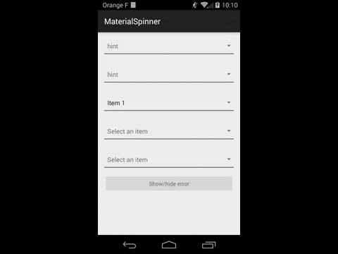

# MaterialSpinner
[](http://android-arsenal.com/details/1/1720)

Spinner with Material Design - Down to API 9

This library provides you a Spinner with the Material style. You can use it like any regular Spinner. 
Add floating label text, hint and error messages.

## Screenshots


## Gradle Dependency
Use this dependency in your build.gradle file to reference this library in your project

```groovy
compile 'com.github.ganfra:material-spinner:1.0.2'
```

If you use other libraries requiring nineoldandroids and appcompat-v7 like [MaterialEditText](https://github.com/rengwuxian/MaterialEditText/) make sure to exclude them :
```groovy
compile ('com.github.ganfra:material-spinner:1.0.2'){
        exclude group: 'com.nineoldandroids', module: 'library'
        exclude group: 'com.android.support', module: 'appcompat-v7'
}
```


## Usages

In the xml : 

```xml
<fr.ganfra.materialspinner.MaterialSpinner
        android:id="@+id/spinner"
        app:ms_multiline="false"
        app:ms_hint="hint"
        app:ms_floatingLabelText="floating label"
        app:ms_baseColor="@color/base"
        app:ms_highlightColor="@color/highlight"
        app:ms_errorColor="@color/error"
        app:ms_typeface="typeface.ttf"
        app:ms_thickness="@integer/int2"
        android:layout_width="fill_parent"
        android:layout_height="wrap_content" />
```
You can set a hint and a floating label text. If no floating label text is provided, the hint will be set instead.

For `ms_thickness` you have to declare the value as integer resource. I.e declare a file in res/values named `integers.xml`

```xml
<?xml version="1.0" encoding="UTF-8"?>
<resources>
    <integer name="int1">1</integer>
    <integer name="int2">2</integer>
</resources>
```

Java side, you use it like a regular spinner, setting an adapter to it.
```java
 String[] ITEMS = {"Item 1", "Item 2", "Item 3", "Item 4", "Item 5", "Item 6"};
 ArrayAdapter<String> adapter = new ArrayAdapter<String>(this, android.R.layout.simple_spinner_item, ITEMS);
 adapter.setDropDownViewResource(android.R.layout.simple_spinner_dropdown_item);
 spinner = (MaterialSpinner) findViewById(R.id.spinner);
 spinner.setAdapter(adapter);
```

If you need to set an error message, you can do it the same way than with an EditText :
```java
 //Activate
 spinner.setError("Error");
 //Desactivate
 spinner.setError(null);
```
You can choose to have a scrolling animation or to set the error message on multiple lines with the "ms_multiline" attribute in xml (default is true).


## License

    Copyright 2015 François Ganard

    Licensed under the Apache License, Version 2.0 (the "License");
    you may not use this file except in compliance with the License.
    You may obtain a copy of the License at

       http://www.apache.org/licenses/LICENSE-2.0

    Unless required by applicable law or agreed to in writing, software
    distributed under the License is distributed on an "AS IS" BASIS,
    WITHOUT WARRANTIES OR CONDITIONS OF ANY KIND, either express or implied.
    See the License for the specific language governing permissions and
    limitations under the License.


